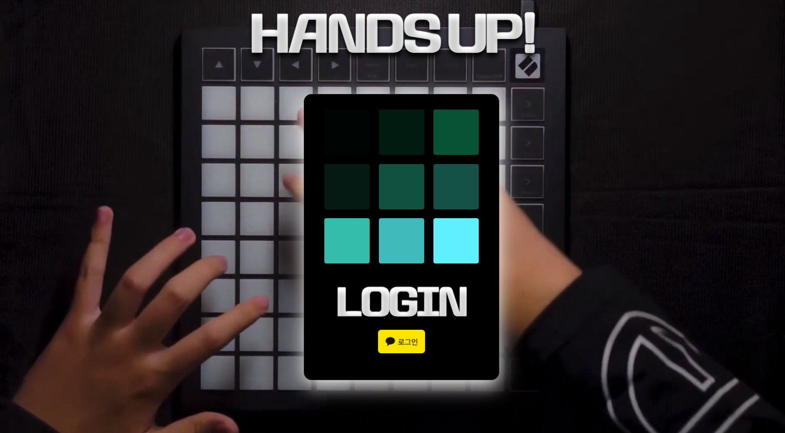
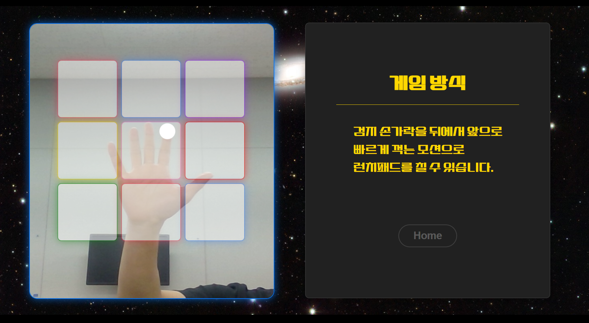
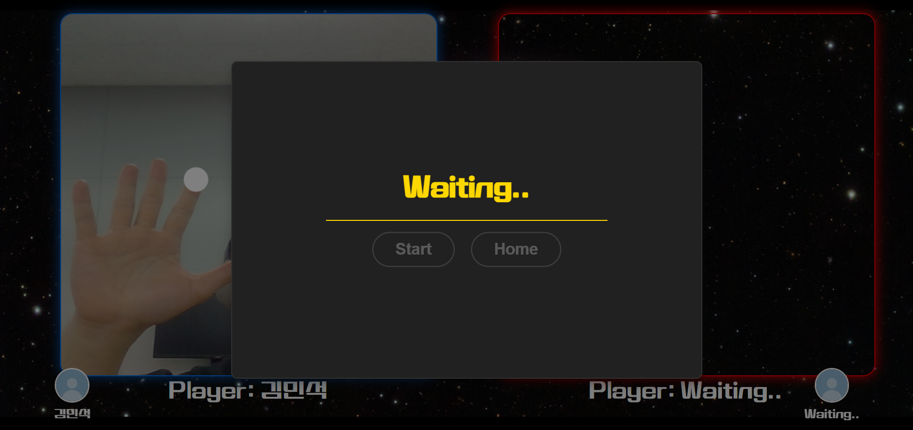

# HandsUp-client

## 💻 프로젝트 소개

[크래프톤 정글 2기] 나만의 무기 갖기 프로젝트.

웹기반 실시간 모션 인식 런치패드 기억력 대전 게임.

## :calendar: 개발 기간

[23.06.29~23.08.12]

- 23.06.29~23.07.06: 팀형성
- 23.07.07~23.07.13: 주제 선정/기획
- 23.07.14~23.07.27: MVP 개발
- 23.07.28~23.08.10: 폴리싱(완성도 올리기)
- 23.08.12: 최종발표

## 👋 멤버 구성 및 역할

- @KimCookieYa: 게임 제작 및 UI/UX 및 모션 인식 모델
- @heekyoung2000: 미디어 서버 구축 및 UI/UX
- @cocomodo: 소셜 로그인 및 회원정보 DB 관리
- @Fsbsnw: 미디어 서버/DB 관리 및 UI/UX

## 🌏 개발

### Front-End

- Vite + React.js + Typescript
- mediapipe

### Back-End

- Node.js + Express.js
- mediasoup
- 카카오 로그인 api
- Dynamo DB

### 배포

- AWS EC2 + Nginx

## 포스터

## 📱 UI

### 로그인 화면

### 로비 화면

### 튜토리얼 화면

### 대기실 화면

### 게임(대전모드) 화면

### 랭킹 화면

## 📚 발표 자료(PPT)

[HandsUp-발표자료](./presentation/HandsUp-발표자료.pdf)

## 최종발표 시연 영상
